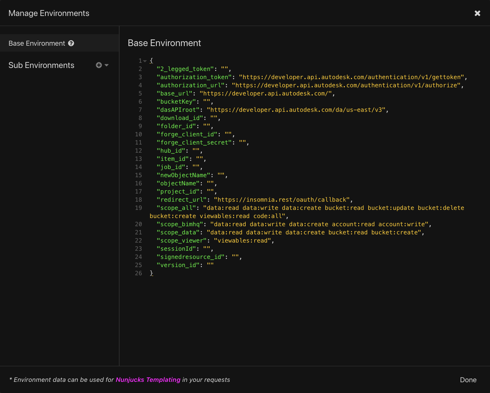

# AutodeskForge-Insomnia-Collections

## Description
Insomnia.REST workflow to use Autodesk Forge API Endpoints

## Setup

1. Download or update Insomnia.REST from [here](https://insomnia.rest/download).

2. Create a Forge App. If you have already created a Forge App then you can skip this and proceed to the next step. 

3. Import the collection JSON in this Repo to your Insomnia Environment.

4. Manage the values of your ENV Values as you advance, some fields have been previously populated but you will need to include values like your Forge API keys.

## Usage

These Insomnia samples will allow you to easily issue REST API calls without using cumbersome cURL commands.

## Written by

Jaime Rosales D.  

[Forge Partner Development](http://forge.autodesk.com)